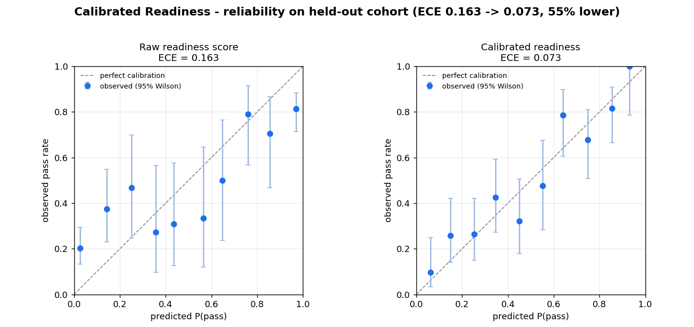

# Calibrated Readiness

**A multi-agent enterprise certification system that reports exam-readiness as a
*measured quantity with a confidence interval* — and lets you verify the claim in
60 seconds.**

Built for the Microsoft Foundry "Reasoning Agents" challenge (Battle #2): a
multi-agent enterprise learning / team certification system.

---

## The differentiator

Most submissions to this challenge will generate study plans and practice
questions. So does this one — but that is table stakes. The thing that sets
Calibrated Readiness apart is **measurement**:

> Instead of saying *"you're probably ready,"* it says *"your calibrated
> probability of passing is 0.78, 95% CI [0.69, 0.85] — borderline,"* and it can
> **prove that number is honest** with a reliability diagram checked against
> labeled outcomes.

A raw practice-test score is systematically overconfident. Calibrated Readiness
fits a calibration map against historical pass/fail data, attaches a confidence
interval via bootstrap, and reports Expected Calibration Error (ECE) on a
held-out cohort. Readiness becomes falsifiable, not a vibe.

On our synthetic benchmark (600 learners, temperature scaling), calibration cuts
**ECE from 0.163 → 0.073 (≈55% lower)** on the held-out cohort. *(That figure
depends on two documented knobs — the simulator `gain` and the bin count — so we
quote it "on our synthetic benchmark," not as a law.)*



The left panel is the raw score (points sag off the diagonal — overconfident).
The right panel is calibrated (points hug the diagonal; the dashed line of
perfect calibration passes through most 95% Wilson bands). **That visual is the
falsification test.**

---

## 60-second verification

No Azure, no API keys — this is the core of the project and it runs anywhere.

```bash
pip install -r requirements.txt
python scripts/run_calibration.py        # writes data/reliability.png + metrics.json
pytest -q                                 # 5 tests that lock the claims
```

Expected headline:

```
ECE 0.163 -> 0.073 (55% lower) on the held-out cohort [method=temperature, gain=1.9, bins=10]
  fitted temperature T = 2.37 (>1 => was overconfident)
```

Try `--method isotonic` to see why temperature scaling is the right default here:
isotonic overfits this cohort size (its worst-bin error, MCE, blows up to ~0.78).

---

## What the system does (architecture)

Four agents routed by **handoff orchestration** (`HandoffBuilder`), with the
**triage / Manager-Insights** agent as the entry point:

```
            ┌─────────────────────────── triage (Manager Insights) ───────────────────────────┐
            │  routes by calibrated readiness risk                                             │
            ▼                         ▼                              ▼
        readiness ◀──────────▶   study_plan  ──────────▶        practice
   (calibrated P + CI)        (Foundry IQ grounded)        (Foundry IQ grounded)
```

- **triage** — triages learners into ready / borderline / at-risk and decides who
  needs what. Calls `cohort_risk_summary`. Never invents numbers.
- **readiness** — returns the calibrated probability + 95% CI from the *same*
  verified pipeline the reliability diagram uses (`assess_readiness` tool).
- **study_plan** — builds a plan for under-ready learners, grounded in the
  knowledge base; fits it to the learner's available hours (Work IQ pattern) and
  prioritizes org-weak topics (Fabric IQ pattern).
- **practice** — generates blueprint-grounded practice questions.

Handoff (not sequential/concurrent) is the right pattern because routing is
genuinely dynamic: the readiness agent can bounce control back to triage when a
learner isn't ready, forming a **readiness loop**.

### The IQ layers
- **Foundry IQ — implemented for real.** `AzureAISearchContextProvider(mode="agentic")`
  injects agentic, multi-hop retrieval over a Knowledge Base into the
  knowledge-grounded agents (see `calibrated_readiness/foundry_iq.py`).
- **Work IQ / Fabric IQ — clearly-labeled synthetic patterns** (`tools.py`),
  showing exactly where Microsoft 365 and Fabric analytics signals plug in,
  without pretending to call live tenants in this build.

---

## Running the agents

```bash
python app/demo.py --mode offline   # tells the whole story with zero cloud (always works)
```

For the live path:

```bash
cp .env.example .env                # fill in your Foundry + Search endpoints
pip install -r requirements-agents.txt
python app/demo.py --mode live
```

`app/demo.py` auto-detects: it runs live if the Azure env vars are set, otherwise
it runs the offline demo. **Read [docs/LIVE_FOUNDRY_NOTES.md](docs/LIVE_FOUNDRY_NOTES.md)
before a live run** — it documents the exact, current Agent Framework API
(verified against the installed packages) and a known pre-release version
incompatibility you must resolve first.

---

## Hosted / cloud deployment

The system is packaged so the verifiable core runs anywhere and the agent layer
can be promoted to a **Foundry Hosted Agent** when you have a live endpoint.

**Container.** The default image runs the verification with no cloud:

```bash
docker build -t calibrated-readiness .
docker run --rm -v "$PWD/data:/app/data" calibrated-readiness   # regenerates the diagram
```

Add the agent layer for the live demo:

```bash
docker build --build-arg INSTALL_AGENTS=true -t calibrated-readiness:agents .
```

**Hosted Agent story.** The handoff workflow is exposed as a single agent via
`Workflow.as_agent(...)` (see `calibrated_readiness/orchestration.py`), so it can
be hosted and invoked like any other agent. To deploy on Azure AI Foundry:

1. **Knowledge base.** Create a Foundry IQ knowledge base from the three docs in
   `knowledge/` (exam blueprint, study resources, readiness policy) and set
   `FOUNDRY_KNOWLEDGE_BASE` to its name.
2. **Identity.** Use managed identity end-to-end — the code uses
   `DefaultAzureCredential`, so no keys live in the image. Grant the hosting
   identity the Search and Foundry data-plane roles.
3. **Publish.** Build with `INSTALL_AGENTS=true`, push the image to your registry,
   and run it as a container app / hosted agent with the `.env` values supplied as
   app settings. The container's entrypoint can be switched from the verification
   to `python app/demo.py --mode live` (or a thin server) for the hosted agent.

This repo builds locally and documents the hosted path; a live Azure deployment
is intentionally out of scope for the submission (see Status).

---

## Repository layout

```
calibrated_readiness/      the package
  config.py                all knobs that affect a published number (traceable)
  synthetic_data.py        Phase 1 - latent-ability cohort, two-tier ground truth
  metrics.py               ECE / MCE / Brier + Wilson-band reliability table
  calibration.py           Phase 3 - temperature & isotonic, readiness-with-CI
  reliability.py           the reliability-diagram renderer
  pipeline.py              one benchmark used by both the CLI and the agents
  tools.py                 agent tools (bridge to the verified pipeline) + IQ patterns
  foundry_iq.py            Foundry IQ + Azure client wiring (real, current API)
  agents.py                Phase 4 - the four agents
  orchestration.py         HandoffBuilder readiness loop + as_agent
scripts/                   generate_data.py, run_calibration.py (the 60s check)
app/demo.py                end-to-end demo (offline + live)
knowledge/                 3 synthetic docs for the Foundry IQ knowledge base
tests/                     claim-locking test suite
docs/                      ARCHITECTURE, LIVE_FOUNDRY_NOTES, DEMO_SCRIPT
data/                      committed reliability.png + metrics.json
```

---

## Status

| Phase | State |
| --- | --- |
| 1 — synthetic data (600 learners, two-tier truth) | ✅ runs |
| 3 — calibration core (ECE 0.163→0.073, Wilson bands) | ✅ runs + tested |
| 4 — four agents + triage + handoff orchestration | ✅ written against verified API, imports clean |
| 5 — packaging (requirements, Dockerfile, README, knowledge docs) | ✅ done |
| 6 — demo + 60-second verification | ✅ done |
| 0 — Azure/Foundry tenant setup | ⬜ user-provided |
| 2 — Foundry IQ knowledge base (needs Phase 0) | ⬜ documented, needs live tenant |

**Honest caveats.** Everything touching a *live* Foundry endpoint (auth, the real
handoff event stream, the exact client kwargs) is untested against a running
service — the first live run will likely need small fixes, and
`docs/LIVE_FOUNDRY_NOTES.md` lists the ones we can already predict. The
calibration core, by contrast, is fully runnable and tested here.

## License

MIT — see `LICENSE`.
